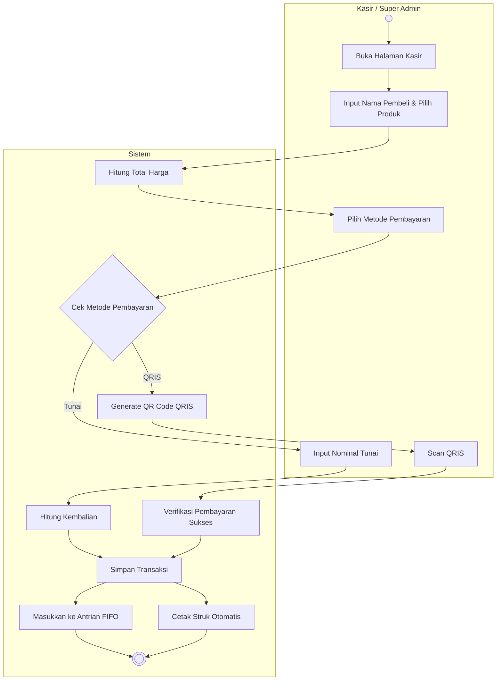

# Activity Diagram: Input Pesanan & Metode Pembayaran

### Penjelasan:
1. **Aktor** membuka halaman Kasir/Input Pesanan.
2. **Aktor** menginput nama pembeli dan memilih produk ke dalam keranjang belanja.
3. **Sistem** otomatis menghitung total harga dari produk yang dipilih.
4. **Aktor** memilih metode pembayaran (Tunai atau QRIS).
5. Jika **Tunai**, aktor menginput uang yang diterima lalu sistem menghitung kembalian.
6. Jika **QRIS**, sistem membuat kode QR, aktor (pembeli) memindai, dan sistem memverifikasi pembayaran.
7. Setelah pembayaran dikonfirmasi, **Sistem** menyimpan transaksi.
8. Secara simultan, **Sistem** memasukkan pesanan tersebut ke antrian FIFO dan mencetak struk otomatis.
