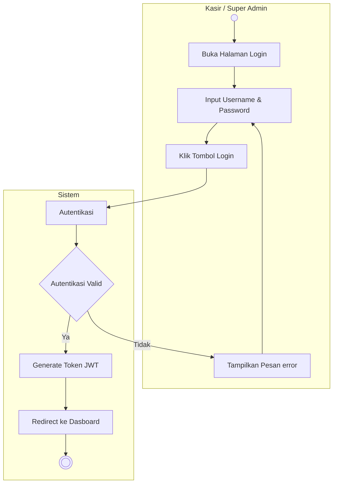

# Activity Diagram: Login

### Penjelasan:
1. **Aktor** (Kasir / Super Admin) membuka halaman login.
2. **Aktor** memasukkan *username* dan *password* lalu mengklik tombol login.
3. **Sistem** melakukan autentikasi dengan mencocokkan data yang dimasukkan dengan database.
4. Jika **Autentikasi Tidak Valid**, sistem akan menampilkan pesan error ke aktor, dan aktor harus memasukkan ulang kredensial.
5. Jika **Autentikasi Valid**, sistem akan men-generate token JWT (Json Web Token) sebagai tanda sesi yang valid.
6. **Sistem** akan me-redirect aktor ke halaman Dasboard dan proses login selesai.
