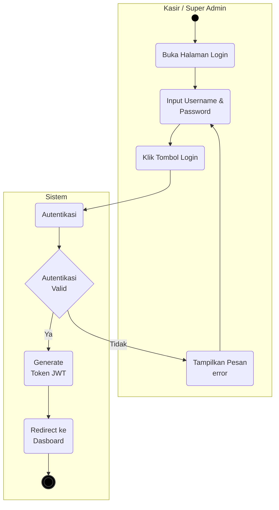

# Activity Diagram: Login

Berikut adalah representasi Activity Diagram dalam format sintaks Mermaid JS, dibuat sama persis dengan alur dan struktur dari gambar referensi Anda.

```mermaid
flowchart TD
    %% Pengaturan Swimlane Kasir / Super Admin
    subgraph KSA [Kasir / Super Admin]
        direction TB
        start(( ))
        BukaLogin(Buka Halaman Login)
        InputUser(Input Username &<br>Password)
        KlikLogin(Klik Tombol Login)
        PesanError(Tampilkan Pesan<br>error)
    end

    %% Pengaturan Swimlane Sistem
    subgraph SYS [Sistem]
        direction TB
        Autentikasi(Autentikasi)
        Validasi{Autentikasi<br>Valid}
        GenToken(Generate<br>Token JWT)
        Redirect(Redirect ke<br>Dasboard)
        finish((( )))
    end

    %% Alur Proses (Flow)
    start --> BukaLogin
    BukaLogin --> InputUser
    InputUser --> KlikLogin
    
    %% Menyeberang ke Sistem
    KlikLogin --> Autentikasi
    Autentikasi --> Validasi
    
    %% Percabangan (Decision)
    Validasi -- Ya --> GenToken
    Validasi -- Tidak --> PesanError
    
    %% Kembali ke Input (Looping/Retry)
    PesanError --> InputUser
    
    %% Alur Sukses
    GenToken --> Redirect
    Redirect --> finish

    %% Styling Start dan End Node agar hitam solid (UML Standard)
    style start fill:#000,stroke:#000
    style finish fill:#000,stroke:#333,stroke-width:2px
```
