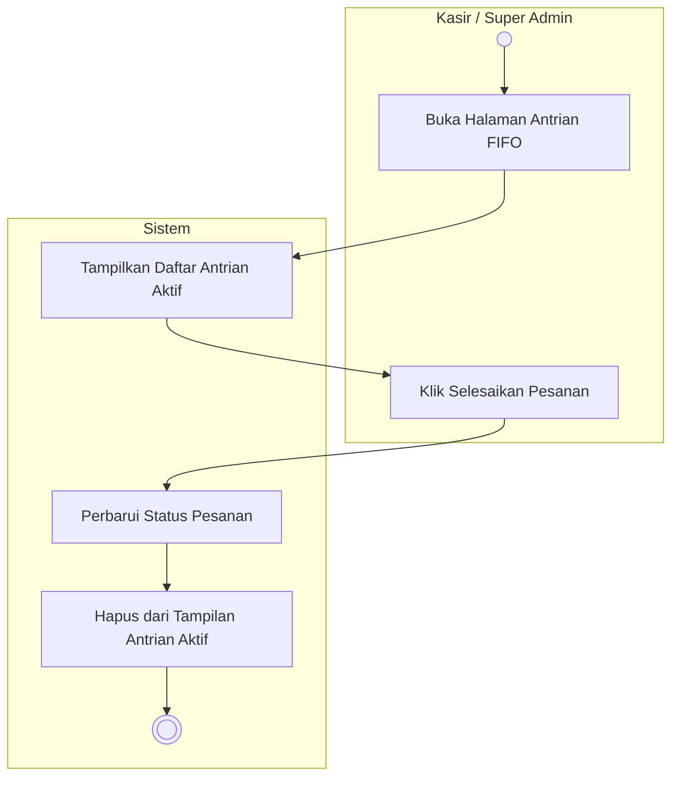

# Activity Diagram: Memantau Antrian FIFO

### Penjelasan:
1. **Aktor** membuka halaman Antrian FIFO.
2. **Sistem** menampilkan daftar pesanan yang berstatus aktif berdasarkan waktu (First In First Out).
3. Setelah pesanan selesai dibuat (disajikan), **Aktor** mengklik tombol selesaikan pada pesanan paling awal tersebut.
4. **Sistem** memperbarui status pesanan menjadi selesai di database.
5. **Sistem** menghapus pesanan tersebut dari layar antrian aktif.
