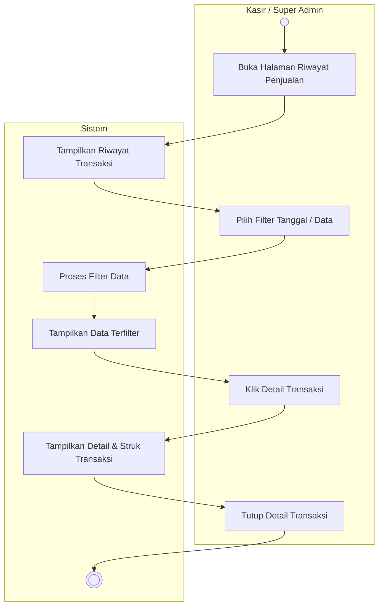

# Activity Diagram: Memantau Riwayat Penjualan

### Penjelasan:
1. **Aktor** membuka halaman Riwayat Penjualan.
2. **Sistem** menampilkan daftar seluruh transaksi yang sudah selesai.
3. **Aktor** dapat mengisi form filter tanggal atau pencarian spesifik.
4. **Sistem** memproses filter dan menampilkan data transaksi yang sesuai.
5. **Aktor** mengklik tombol detail pada salah satu transaksi.
6. **Sistem** memunculkan jendela/halaman berisi rincian pesanan tersebut (beserta histori struk).
7. **Aktor** dapat menutup rincian transaksi tersebut jika sudah selesai melihatnya.
