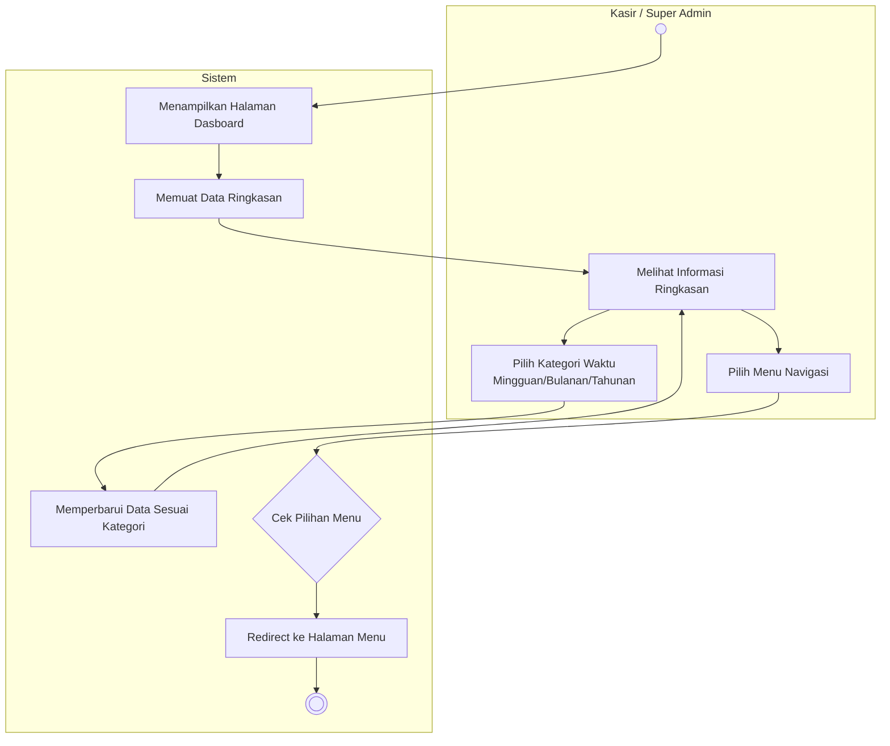

# Activity Diagram: Dasboard

### Penjelasan:
1. Setelah login berhasil, **Sistem** menampilkan halaman Dasboard dan secara otomatis memuat data ringkasan.
2. **Aktor** melihat informasi ringkasan (seperti jumlah produk, total penjualan) yang ditampilkan oleh sistem.
3. **Aktor** dapat memilih kategori waktu (Mingguan, Bulanan, dan Tahunan) untuk memfilter data ringkasan.
4. Jika kategori dipilih, **Sistem** akan memperbarui data ringkasan sesuai dengan kategori waktu dan kembali menampilkannya.
5. **Aktor** memilih menu navigasi untuk pindah ke modul lain (seperti Kelola Akun, Kelola Produk, Kasir, atau Riwayat).
6. **Sistem** mengecek pilihan menu dari aktor lalu meredirect aktor ke halaman menu yang dituju.
