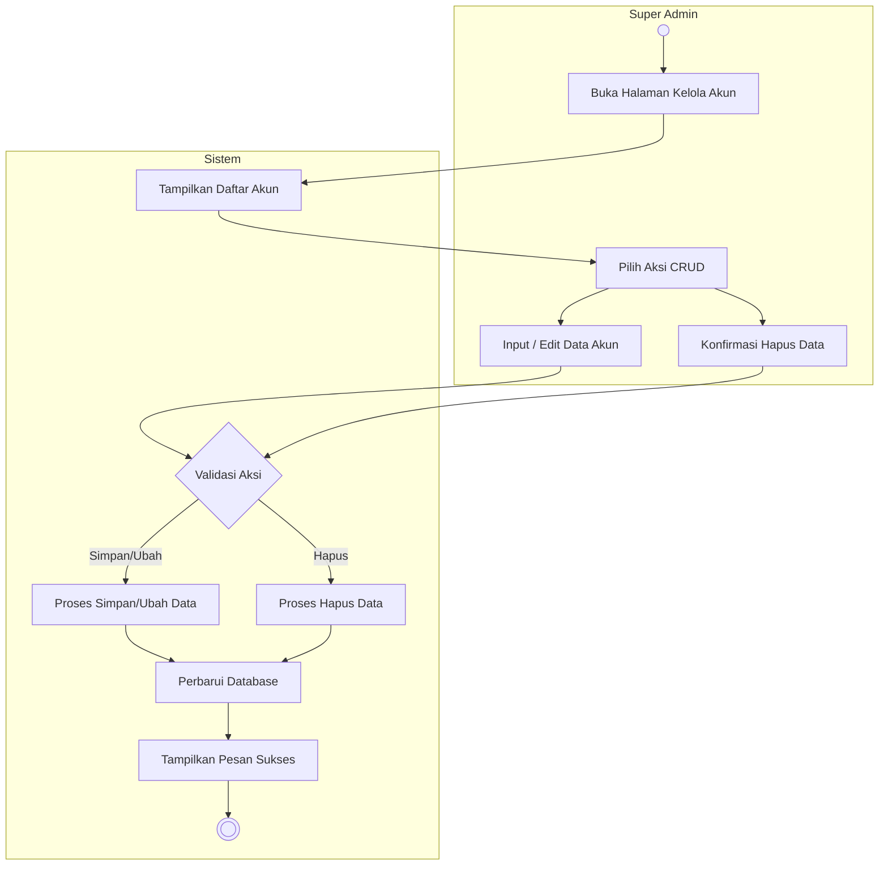

# Activity Diagram: Kelola Akun (CRUD)

### Penjelasan:
1. **Aktor** (Super Admin) membuka halaman kelola akun.
2. **Sistem** menampilkan daftar akun yang sudah ada.
3. **Aktor** memilih aksi CRUD (Tambah, Edit, atau Hapus).
4. Jika Tambah atau Edit, **Aktor** memasukkan atau mengubah data akun. Jika Hapus, **Aktor** memberikan konfirmasi penghapusan.
5. **Sistem** memvalidasi aksi yang dipilih, lalu memproses penyimpanan, perubahan, atau penghapusan data.
6. **Sistem** memperbarui database, menampilkan pesan berhasil ke aktor, lalu proses selesai.
