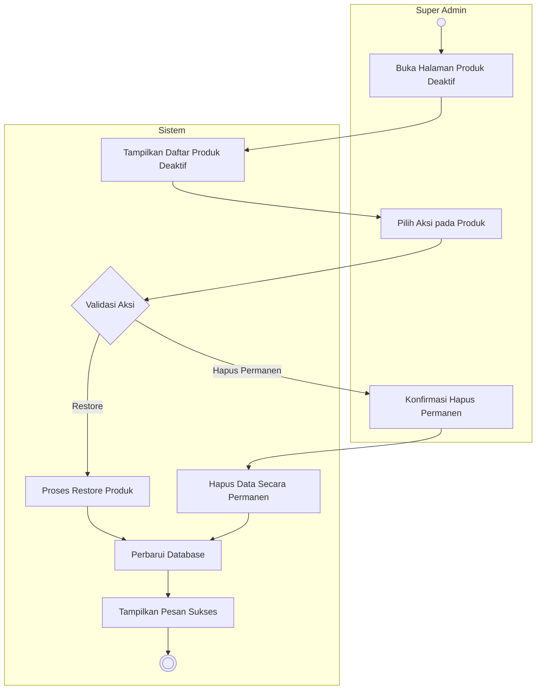

# Activity Diagram: Kelola Produk Deaktif

### Penjelasan:
1. **Aktor** (Super Admin) membuka halaman Produk Deaktif (tempat menyimpan daftar produk yang tidak aktif atau di-soft delete).
2. **Sistem** memuat dan menampilkan daftar produk deaktif dari database.
3. **Aktor** memilih aksi yang ingin dilakukan terhadap produk tertentu (opsinya biasanya adalah **Restore/Aktifkan Kembali** atau **Hapus Permanen**).
4. **Sistem** mengecek dan memvalidasi pilihan aksi tersebut.
5. Jika memilih **Restore**, sistem akan mengubah status produk tersebut kembali menjadi aktif di database.
6. Jika memilih **Hapus Permanen**, sistem akan meminta **Aktor** untuk mengkonfirmasi tindakan (karena data akan hilang). Setelah dikonfirmasi, sistem menghapus data secara permanen.
7. **Sistem** memperbarui database, menampilkan notifikasi sukses kepada aktor, dan proses pengelolaan produk deaktif selesai.
