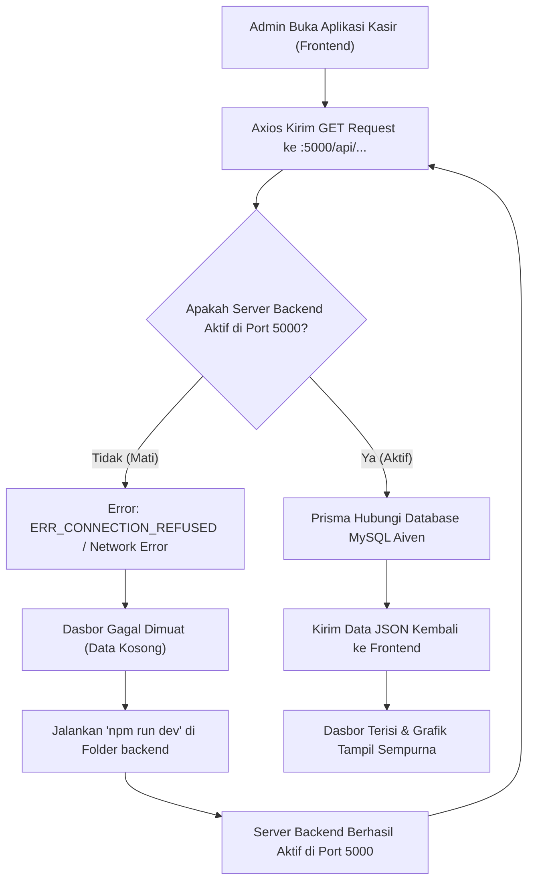
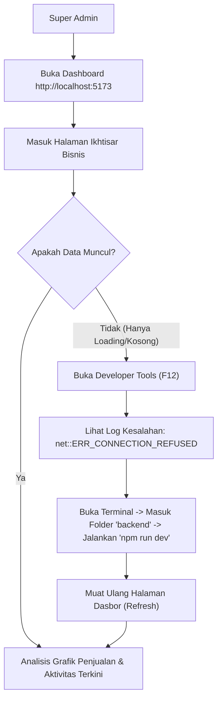
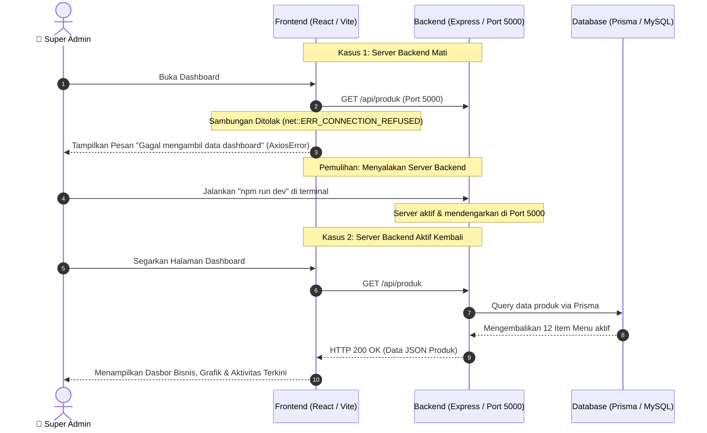

# Analisis Error: Connection Refused (net::ERR_CONNECTION_REFUSED)

Dokumen ini menganalisis penyebab terjadinya kesalahan `AxiosError: Network Error` pada Dasbor Admin serta solusi penanganannya.

---

## 1. Penyebab Masalah (Root Cause Analysis)
Kesalahan `net::ERR_CONNECTION_REFUSED` ke alamat `http://localhost:5000` terjadi karena **server backend Express.js tidak berjalan** pada port `5000` ketika frontend mencoba mengirim permintaan API (`/api/produk`, `/api/pesanan/antrian`, `/api/riwayat`).

*   **Gejala:** Dasbor Admin hanya menampilkan loading tanpa henti atau data kosong, disertai tumpukan galat (error stack) Axios Network Error di konsol pengembang (developer tools).
*   **Investigasi:** Port `5000` dicek dan statusnya bebas (tidak ada proses yang mendengarkan). Ini membuktikan bahwa proses `nodemon src/server.js` terhenti secara tidak sengaja.
*   **Solusi:** Menyalakan kembali server backend menggunakan `npm run dev` di folder `backend`. Port sekarang aktif dan data dasbor kembali termuat dengan benar.

---

## 2. Diagram Aliran Proses Penanganan (Flowchart)

---

## 3. Aliran Navigasi Pengguna saat Error Terjadi (User Flow)

---

## 4. Diagram Penanganan Hambatan (Diagram Error)

Sequence Diagram berikut menunjukkan bagaimana koneksi terputus dan dipulihkan kembali:

