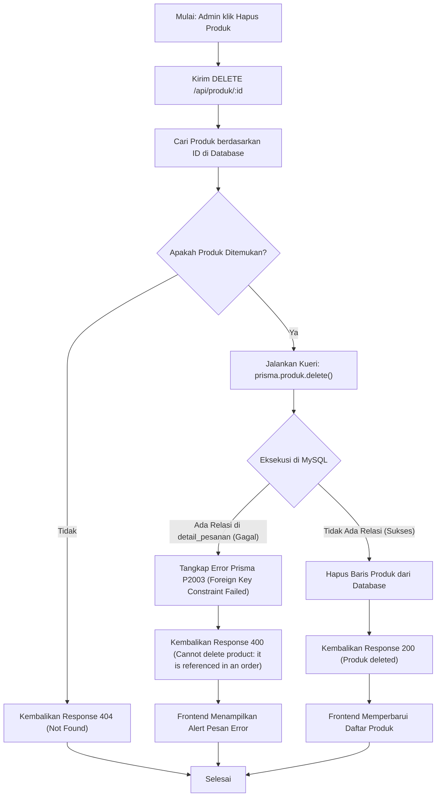
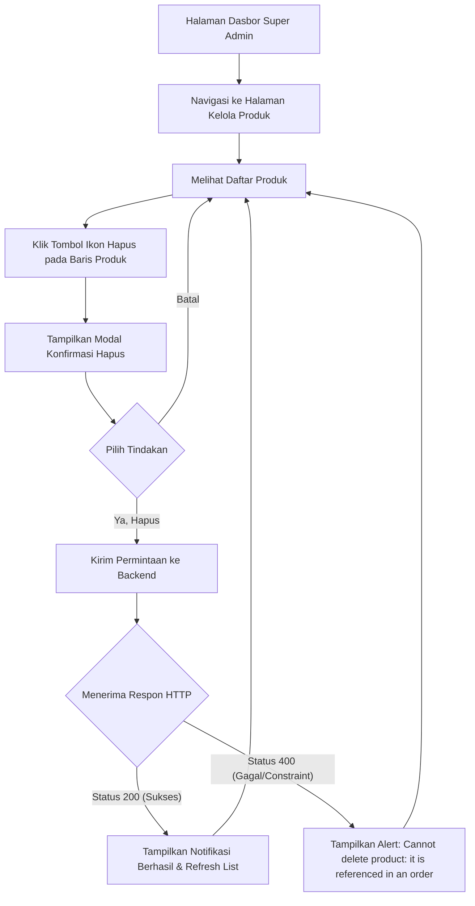
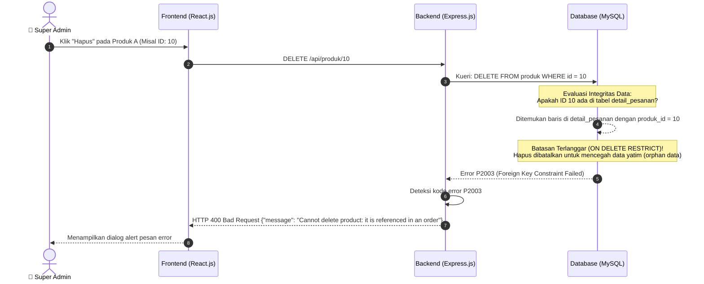

# Analisis Masalah: Gagal Hapus Produk Berelasi

Dokumen ini menjelaskan mengapa sistem memunculkan peringatan **"Cannot delete product: it is referenced in an order"** saat Anda mencoba menghapus produk tertentu, disertai dengan alur logika (Flowchart), aliran pengguna (User Flow), dan diagram kegagalan (Error Diagram).

---

## 1. Analisis Penyebab

Peringatan tersebut muncul karena adanya sistem **Constraint Foreign Key (Batasan Kunci Asing)** di dalam database MySQL. Hubungan ini diatur melalui Prisma ORM dalam skema relasi berikut:

*   Tabel `produk` memiliki relasi *one-to-many* ke tabel `detail_pesanan` (`DetailPesanan`).
*   Setiap kali kasir membuat pesanan baru yang berisi produk tersebut, data transaksi akan disimpan ke dalam tabel `detail_pesanan` dengan mereferensikan `produk_id` dari produk tersebut.
*   Secara default, MySQL menerapkan aturan `ON DELETE RESTRICT` pada kunci asing tersebut. Artinya, **produk tidak boleh dihapus selama masih ada riwayat transaksi yang mereferensikannya**.

### Mengapa Aturan Ini Penting?
Jika sistem memperbolehkan penghapusan produk yang sudah pernah dibeli:
1.  **Kerusakan Laporan (Data Orphan):** Tabel riwayat penjualan (`detail_pesanan`) akan merujuk ke ID produk yang sudah tidak ada di tabel `produk`. Hal ini menyebabkan error saat aplikasi memuat halaman riwayat penjualan atau dasbor grafik karena produk tidak ditemukan.
2.  **Kehilangan Audit Penjualan:** Data laporan keuangan menjadi tidak akurat karena detail produk yang terjual hilang dari database.

---

## 2. Flowchart Penghapusan Produk (Hapus vs Tolak)

Flowchart berikut menggambarkan logika yang terjadi di dalam backend Express.js ketika menerima permintaan hapus produk:



---

## 3. Aliran Pengguna (User Flow)

Berikut adalah navigasi layar dan respons pengguna saat menghadapi error penghapusan produk:



---

## 4. Diagram Kegagalan Relasi (Error Diagram)

Diagram berikut memvisualisasikan bagaimana database MySQL memblokir aksi penghapusan untuk menjaga integritas data:



---

## 5. Rekomendasi Solusi Alternatif (Soft Delete / Archive)

Jika Anda tetap ingin menyembunyikan produk tersebut dari halaman penjualan kasir tanpa merusak data penjualan masa lalu, solusi terbaik adalah menerapkan metode **Soft Delete (Arsip/Nonaktifkan)**:

1.  **Tambah Kolom Status Keaktifan:** Tambahkan kolom boolean `isAvailable` atau `isActive` pada skema database produk.
    ```prisma
    model Produk {
      ...
      isActive Boolean @default(true) @map("is_active")
    }
    ```
2.  **Ubah Tombol Hapus Menjadi Nonaktifkan:** Alih-alih menghapus data secara permanen (`DELETE`), sistem hanya mengubah nilai `isActive` menjadi `false` (`UPDATE`).
3.  **Saring Menu Penjualan:** Halaman transaksi kasir (`InputPesanan.jsx`) hanya akan memuat produk yang memiliki nilai `isActive: true`. Dengan cara ini, produk tidak muncul saat membuat pesanan baru, namun riwayat penjualan lama Anda tetap aman dan utuh.
