# IMPLEMENTATION PLAN
## Rancang Bangun Aplikasi Kasir Berbasis Web dengan Fitur Manajemen Antrian Menggunakan Metode FIFO Pada Usaha Bakso

| Atribut | Keterangan |
|---|---|
| Frontend | React.js |
| Backend | Express.js (Node.js) |
| Database | MySQL |
| Pola Arsitektur | Client-Server / REST API, 3-Tier Architecture |
| Aktor | Kasir, Super Admin |
| Metode Antrian | First-In-First-Out (FIFO) |

---

## Daftar Isi

1. [Pendahuluan](#1-pendahuluan)
2. [Arsitektur Sistem](#2-arsitektur-sistem)
3. [Software Modeling](#3-software-modeling)
4. [Flowchart Sistem](#4-flowchart-sistem)
5. [User Flow](#5-user-flow)
6. [ERD (Entity Relationship Diagram)](#6-erd-entity-relationship-diagram)
7. [Pemetaan REST API](#7-pemetaan-rest-api)
8. [Rencana Implementasi (Roadmap)](#8-rencana-implementasi-roadmap)
9. [Kesimpulan](#9-kesimpulan)

---

## 1. Pendahuluan

### 1.1 Ringkasan Proyek

Aplikasi yang dibangun adalah sistem kasir (*Point of Sale*) berbasis web untuk usaha bakso, dengan fitur utama:

- Login multi-role (Kasir & Super Admin)
- Manajemen data produk (CRUD)
- Input pesanan & nama pembeli oleh kasir
- Pembayaran di awal (*upfront payment*) — Tunai atau QRIS statis
- Pencetakan struk otomatis dengan nomor antrian
- Manajemen antrian dengan metode **FIFO** (*First-In-First-Out*) — status `diproses` → `selesai`
- Riwayat & rekapitulasi penjualan harian

### 1.2 Tech Stack

| Layer | Teknologi | Keterangan |
|---|---|---|
| **Frontend** | React.js, React Router, Axios, Context API / Zustand, TailwindCSS | SPA yang mengonsumsi REST API |
| **Backend** | Express.js (Node.js), JWT, bcrypt, Sequelize / Prisma / `mysql2` | REST API, autentikasi, logika bisnis FIFO |
| **Database** | MySQL | Menyimpan data users, produk, pesanan, pembayaran |
| **Pendukung** | QRIS statis (gambar/kode), Web Print (`window.print` / library cetak struk thermal) | Modul pembayaran & cetak struk |

### 1.3 Struktur Folder (Usulan)

```
frontend/
  src/
    components/        # Komponen UI re-usable (Button, Modal, Table, dll)
    pages/
      Login.jsx
      DashboardKasir.jsx
      DashboardAdmin.jsx
      KelolaProduk.jsx
      InputPesanan.jsx
      MonitorAntrian.jsx
      RiwayatPenjualan.jsx
    services/
      api.js           # instance axios + interceptor JWT
    context/
      AuthContext.jsx
    App.jsx

backend/
  src/
    controllers/
      authController.js
      produkController.js
      pesananController.js
      riwayatController.js
    models/
      User.js
      Produk.js
      Pesanan.js
      DetailPesanan.js
      Pembayaran.js
    routes/
      auth.routes.js
      produk.routes.js
      pesanan.routes.js
      riwayat.routes.js
    middlewares/
      authMiddleware.js   # verifikasi JWT & role
    config/
      db.js
    server.js
```

---

## 2. Arsitektur Sistem

Sistem menggunakan arsitektur **3-tier**: Frontend (React) berkomunikasi dengan Backend (Express REST API) melalui HTTP/JSON, dan Backend berkomunikasi dengan Database (MySQL) melalui query SQL.

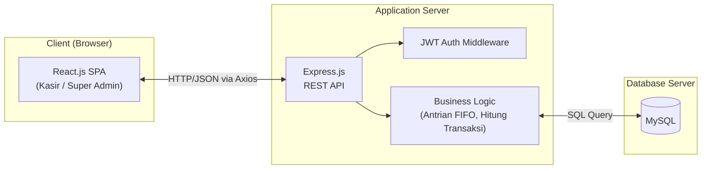

**Penjelasan alur:**
1. Pengguna (Kasir/Super Admin) berinteraksi dengan antarmuka React di browser.
2. Setiap aksi (login, input pesanan, update status, dst.) memicu request HTTP ke Express API.
3. Middleware JWT memverifikasi token & role sebelum request diteruskan ke controller.
4. Business logic (termasuk logika antrian FIFO) mengeksekusi query ke MySQL melalui ORM/driver.
5. Hasil dikembalikan sebagai response JSON ke frontend untuk dirender ulang (real-time update tampilan antrian, dsb).

---

## 3. Software Modeling

### 3.1 Use Case Diagram

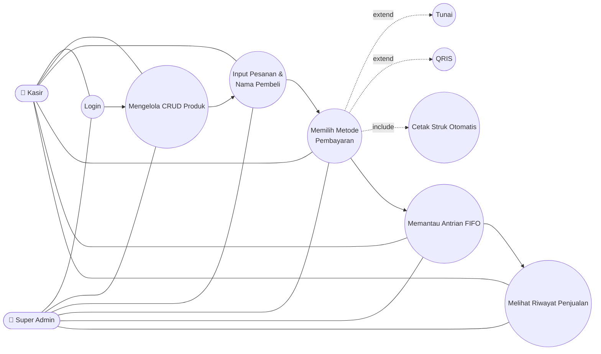

**Deskripsi Use Case:**

| Use Case | Aktor | Deskripsi |
|---|---|---|
| Login | Kasir, Super Admin | Autentikasi pengguna sebelum mengakses sistem |
| Mengelola CRUD Produk | Kasir, Super Admin | Tambah, edit, hapus data produk bakso |
| Input Pesanan & Nama Pembeli | Kasir, Super Admin | Mencatat pesanan beserta identitas pembeli |
| Memilih Metode Pembayaran | Kasir, Super Admin | Menentukan metode bayar (Tunai/QRIS) saat transaksi |
| Tunai *(extend)* | Kasir, Super Admin | Varian pembayaran tunai, memicu hitung kembalian |
| QRIS *(extend)* | Kasir, Super Admin | Varian pembayaran non-tunai via kode QRIS statis |
| Cetak Struk Otomatis *(include)* | Kasir, Super Admin | Selalu dieksekusi setiap pembayaran berhasil dikonfirmasi |
| Memantau Antrian FIFO | Kasir, Super Admin | Melihat & memperbarui status antrian pesanan |
| Melihat Riwayat Penjualan | Kasir, Super Admin | Melihat & memfilter rekap transaksi harian |

> **Catatan praktik terbaik:** Walaupun pada rancangan use case kedua aktor memiliki akses yang sama, untuk keamanan produksi disarankan membatasi hak hapus/CRUD produk dan akses laporan hanya untuk **Super Admin**, sementara Kasir difokuskan pada operasional transaksi harian. Pembatasan ini dapat diterapkan melalui *role-based middleware* di Express.

---

### 3.2 Activity Diagram

#### 3.2.1 Login

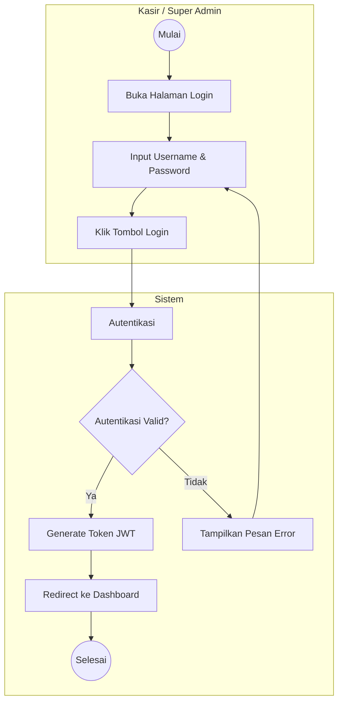

#### 3.2.2 Kelola Produk (CRUD)

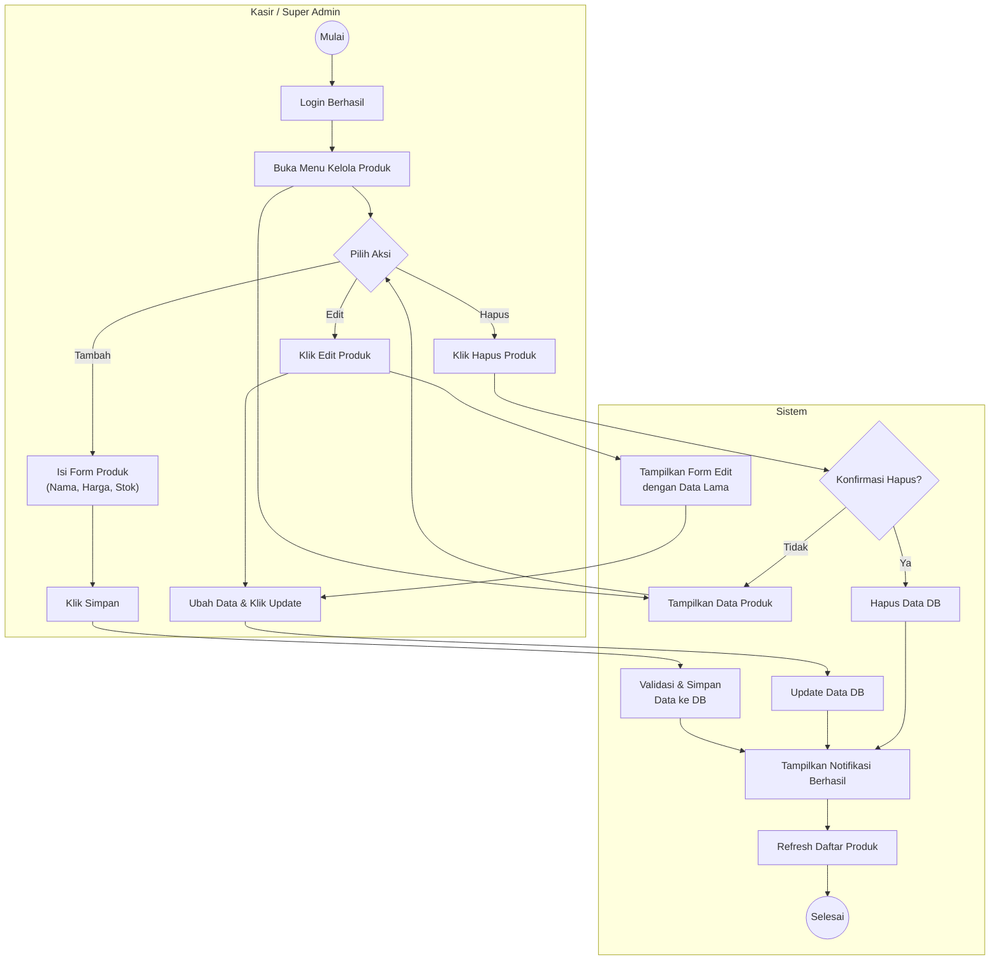

#### 3.2.3 Input Pesanan

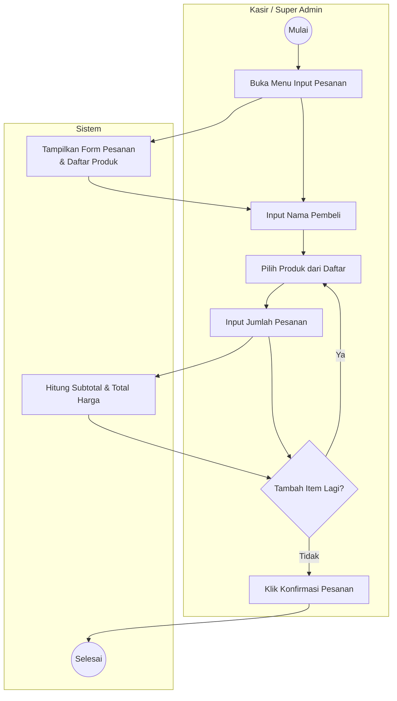

#### 3.2.4 Pembayaran

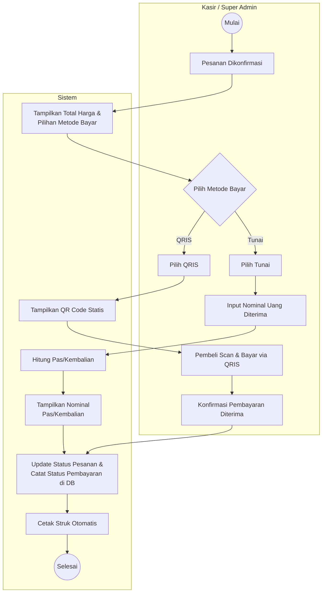

#### 3.2.5 Monitor Antrian (FIFO)

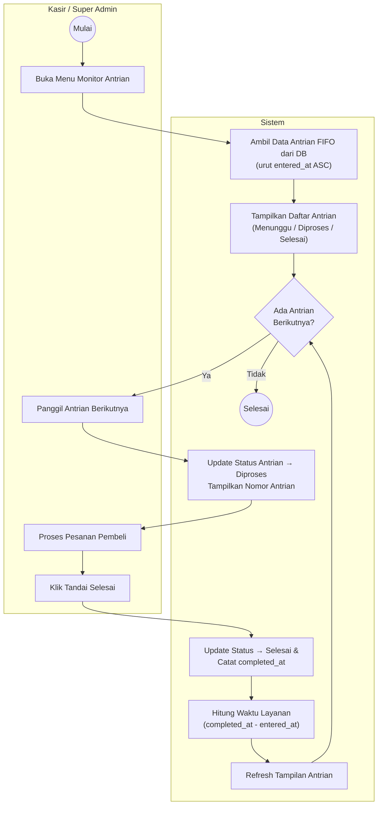

#### 3.2.6 Riwayat Penjualan

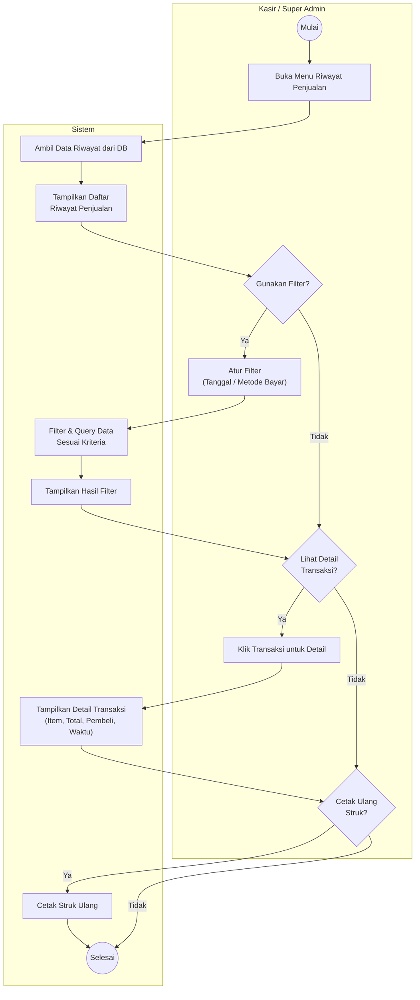

---

### 3.3 Sequence Diagram (Detail Teknis)

Sequence diagram berikut menggambarkan interaksi antar layer (Frontend React, Backend Express, Database MySQL) secara teknis sesuai tech stack yang dipilih, melengkapi activity diagram di atas.

#### 3.3.1 Sequence Diagram — Login

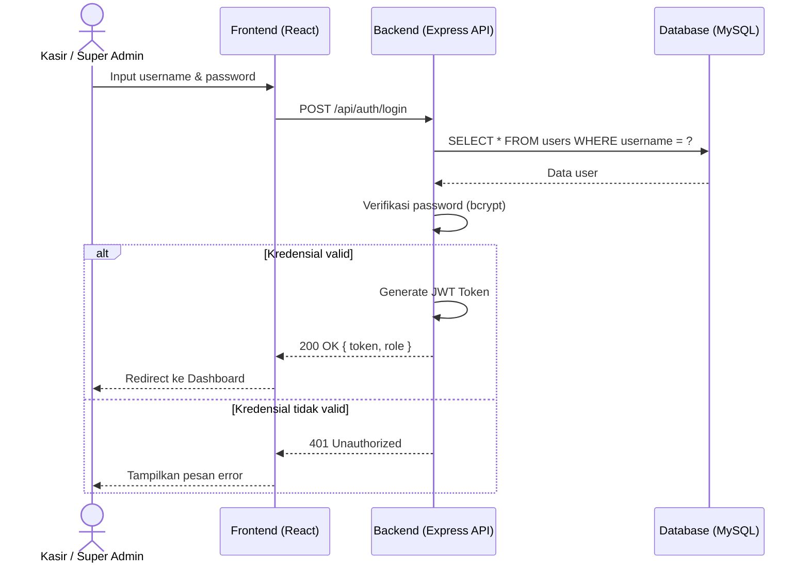

#### 3.3.2 Sequence Diagram — Input Pesanan, Pembayaran, dan Antrian FIFO

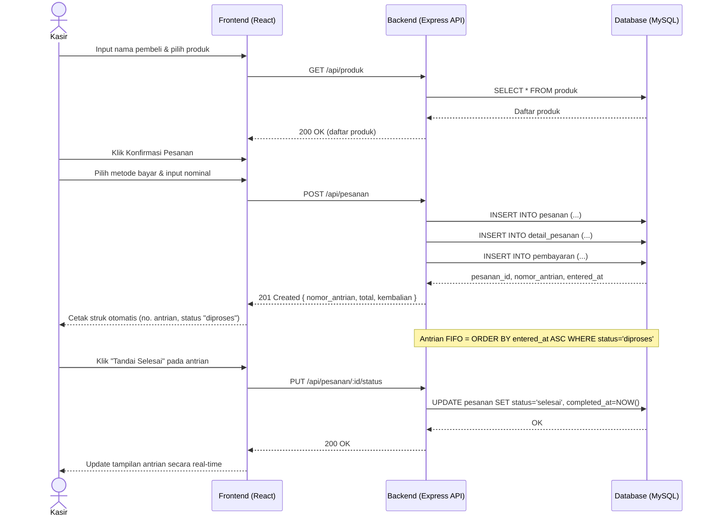

---

## 4. Flowchart Sistem

### 4.1 Flowchart Alur Bisnis Keseluruhan

Flowchart ini menggambarkan alur proses bisnis dari sudut pandang operasional warung bakso secara end-to-end, sebagai pelengkap level abstraksi di atas activity diagram per-modul.

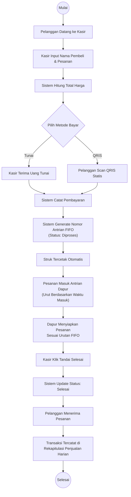

### 4.2 Flowchart Algoritma FIFO

Logika inti yang membedakan sistem ini dari kasir digital konvensional adalah algoritma antrean FIFO berikut:

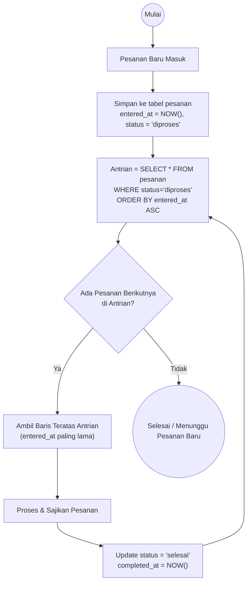

> **Kompleksitas:** Karena pengambilan antrian hanya melibatkan `ORDER BY entered_at ASC` pada kolom yang sebaiknya diberi index, operasi ini berjalan efisien (O(log n) untuk pencarian terurut berkat index B-Tree MySQL) bahkan saat jam sibuk dengan volume pesanan tinggi.

---

## 5. User Flow

Berbeda dengan activity diagram (fokus pada logika proses), user flow berikut menggambarkan **navigasi antar-halaman/screen** yang dilalui pengguna di aplikasi React.

### 5.1 User Flow — Kasir

```mermaid
flowchart TD
    A(("Mulai")) --> B["Halaman Login"]
    B --> C["Dashboard Kasir"]
    C --> D["Menu Input Pesanan"]
    D --> E["Form: Nama Pembeli + Pilih Produk"]
    E --> F["Konfirmasi Pesanan"]
    F --> G["Pilih Metode Pembayaran"]
    G --> H["Struk Tercetak + Nomor Antrian"]
    H --> C
    C --> I["Menu Monitor Antrian"]
    I --> J["Lihat Daftar Antrian"]
    J --> K["Tandai Pesanan Selesai"]
    K --> C
    C --> L["Menu Riwayat Penjualan"]
    L --> M["Lihat / Filter Transaksi"]
    M --> N["Cetak Ulang Struk (opsional)"]
    N --> C
    C --> O["Logout"]
    O --> P(("Selesai"))
```

### 5.2 User Flow — Super Admin

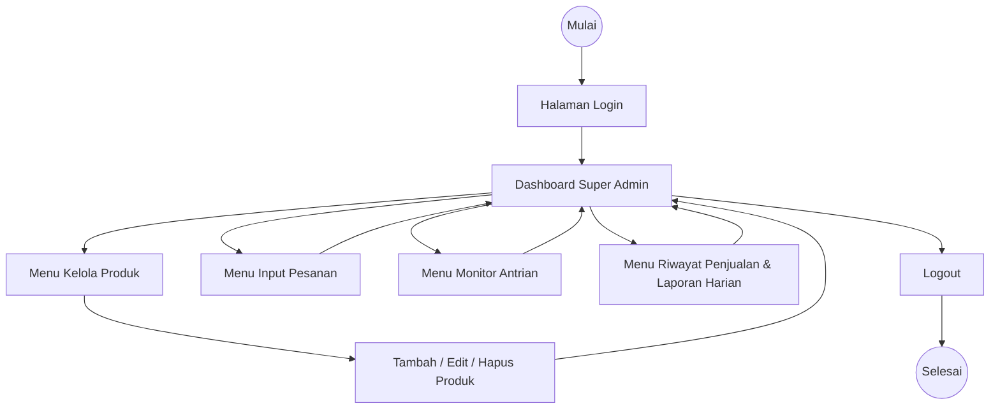

---

## 6. ERD (Entity Relationship Diagram)

### 6.1 Diagram ERD

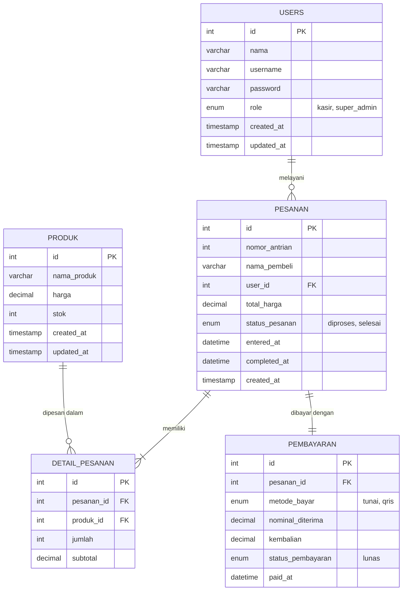

> **Catatan desain:** Tidak dibuat tabel `antrian` terpisah. Status antrian FIFO dikelola langsung melalui kolom `status_pesanan`, `entered_at`, dan `completed_at` pada tabel `PESANAN`, sehingga query antrian cukup `ORDER BY entered_at ASC`. Hal ini konsisten dengan batasan ruang lingkup pada proposal (tidak ada modul stok inventaris/laporan bulanan yang kompleks).

### 6.2 Data Dictionary

**Tabel `users`**

| Kolom | Tipe Data | Keterangan |
|---|---|---|
| id | INT, PK, AUTO_INCREMENT | Identitas unik pengguna |
| nama | VARCHAR(100) | Nama lengkap pengguna |
| username | VARCHAR(50), UNIQUE | Username login |
| password | VARCHAR(255) | Password ter-hash (bcrypt) |
| role | ENUM('kasir','super_admin') | Peran pengguna |
| created_at | TIMESTAMP | Waktu data dibuat |
| updated_at | TIMESTAMP | Waktu data diperbarui |

**Tabel `produk`**

| Kolom | Tipe Data | Keterangan |
|---|---|---|
| id | INT, PK, AUTO_INCREMENT | Identitas unik produk |
| nama_produk | VARCHAR(100) | Nama produk (mis. "Bakso Urat") |
| harga | DECIMAL(10,2) | Harga satuan |
| stok | INT | Jumlah stok tersedia |
| created_at / updated_at | TIMESTAMP | Audit waktu |

**Tabel `pesanan`**

| Kolom | Tipe Data | Keterangan |
|---|---|---|
| id | INT, PK, AUTO_INCREMENT | Identitas unik pesanan |
| nomor_antrian | INT | Nomor antrian yang tercetak di struk |
| nama_pembeli | VARCHAR(100) | Nama pembeli yang diinput kasir |
| user_id | INT, FK → users.id | Kasir yang melayani transaksi |
| total_harga | DECIMAL(10,2) | Total seluruh item pesanan |
| status_pesanan | ENUM('diproses','selesai') | Status FIFO pesanan |
| entered_at | DATETIME | Waktu pesanan masuk (dasar urutan FIFO) |
| completed_at | DATETIME, NULLABLE | Waktu pesanan ditandai selesai |
| created_at | TIMESTAMP | Audit waktu |

**Tabel `detail_pesanan`**

| Kolom | Tipe Data | Keterangan |
|---|---|---|
| id | INT, PK, AUTO_INCREMENT | Identitas unik baris detail |
| pesanan_id | INT, FK → pesanan.id | Relasi ke pesanan induk |
| produk_id | INT, FK → produk.id | Produk yang dipesan |
| jumlah | INT | Kuantitas produk dipesan |
| subtotal | DECIMAL(10,2) | harga × jumlah |

**Tabel `pembayaran`**

| Kolom | Tipe Data | Keterangan |
|---|---|---|
| id | INT, PK, AUTO_INCREMENT | Identitas unik pembayaran |
| pesanan_id | INT, FK → pesanan.id, UNIQUE | Relasi 1:1 ke pesanan |
| metode_bayar | ENUM('tunai','qris') | Metode pembayaran dipilih |
| nominal_diterima | DECIMAL(10,2) | Nominal uang tunai diterima (jika tunai) |
| kembalian | DECIMAL(10,2) | Kembalian (jika tunai) |
| status_pembayaran | ENUM('lunas') | Status pelunasan (upfront payment) |
| paid_at | DATETIME | Waktu pembayaran dikonfirmasi |

---

## 7. Pemetaan REST API

| Method | Endpoint | Deskripsi | Role |
|---|---|---|---|
| POST | `/api/auth/login` | Login & terbitkan JWT | Semua |
| GET | `/api/produk` | Lihat daftar produk | Semua |
| POST | `/api/produk` | Tambah produk baru | Kasir/Super Admin |
| PUT | `/api/produk/:id` | Edit produk | Kasir/Super Admin |
| DELETE | `/api/produk/:id` | Hapus produk | Kasir/Super Admin |
| POST | `/api/pesanan` | Buat pesanan baru + catat pembayaran + cetak struk | Kasir/Super Admin |
| GET | `/api/pesanan/antrian` | Lihat antrian FIFO (urut `entered_at ASC`) | Kasir/Super Admin |
| PUT | `/api/pesanan/:id/status` | Update status pesanan → "selesai" | Kasir/Super Admin |
| GET | `/api/riwayat` | Lihat riwayat penjualan (mendukung query filter `tanggal`, `metode_bayar`) | Kasir/Super Admin |
| GET | `/api/riwayat/:id` | Lihat detail satu transaksi | Kasir/Super Admin |
| GET | `/api/riwayat/:id/struk` | Cetak ulang struk transaksi | Kasir/Super Admin |

---

## 8. Rencana Implementasi (Roadmap)

| Fase | Modul | Deskripsi Aktivitas | Estimasi |
|---|---|---|---|
| 1 | Persiapan & Setup | Setup repo, struktur project React + Express, konfigurasi database MySQL, environment variable | Minggu 1 |
| 2 | Autentikasi | Implementasi login, hashing password (bcrypt), JWT, middleware role-based | Minggu 2 |
| 3 | Kelola Produk | CRUD produk (frontend form + backend endpoint + validasi) | Minggu 3 |
| 4 | Input Pesanan | Form input pesanan, kalkulasi subtotal/total, simpan ke DB | Minggu 4 |
| 5 | Pembayaran & Struk | Modul tunai/QRIS, hitung kembalian, generate nomor antrian, cetak struk otomatis | Minggu 5 |
| 6 | Antrian FIFO | Endpoint & UI monitor antrian real-time, tombol update status selesai, hitung waktu layanan | Minggu 6 |
| 7 | Riwayat Penjualan | List + filter (tanggal/metode bayar), detail transaksi, cetak ulang struk | Minggu 7 |
| 8 | Uji Coba | Unit testing, integration testing endpoint, black-box testing UI, UAT bersama pemilik usaha bakso | Minggu 8 |
| 9 | Deployment | Build production, deploy backend (VPS/cloud) & frontend (static hosting), setup database production | Minggu 9 |

---

## 9. Kesimpulan

Dokumen ini menerjemahkan rancangan *software modeling* (use case & activity diagram) yang telah dibuat ke dalam rencana implementasi teknis yang konkret berbasis stack **React.js + Express.js + MySQL**. Dengan adanya flowchart bisnis, flowchart algoritma FIFO, user flow per-role, ERD, serta pemetaan REST API, tim pengembang (atau penulis skripsi secara individu) memiliki panduan yang jelas dari tahap perancangan hingga tahap implementasi dan pengujian aplikasi kasir berbasis web ini.
