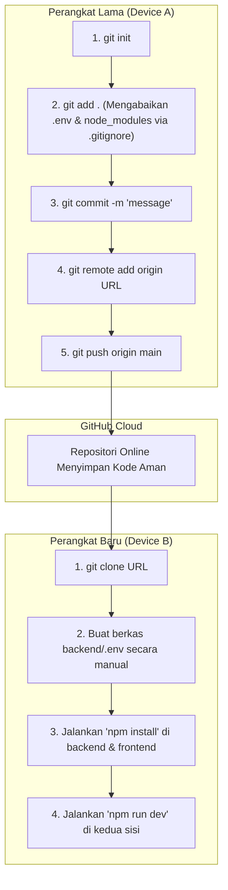
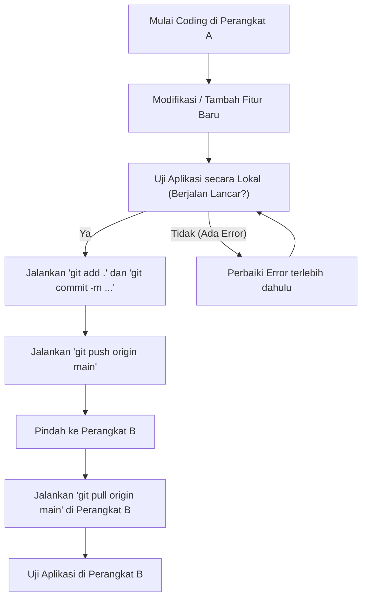
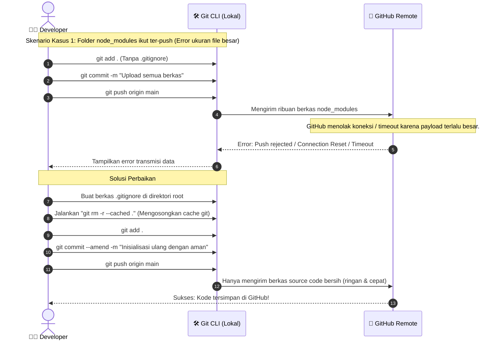

# Panduan Migrasi Proyek ke GitHub (Pindah Perangkat)

Dokumen ini berisi panduan langkah demi langkah untuk mengunggah seluruh berkas proyek **Kasir Baksoku** ke GitHub dari perangkat saat ini (Device A) dan mengunduhnya ke perangkat baru (Device B).

---

## ⚠️ PENTING: Keamanan & Keamanan Data (Warning & Caution)

> [!WARNING]
> **JANGAN PERNAH MENGUNGGAH BERKAS `.env` KE REPOSITORY PUBLIC GITHUB.**
> Berkas `backend/.env` berisi kredensial basis data MySQL Aiven dan kunci rahasia JWT Anda. Jika terunggah ke repositori publik, pihak lain dapat mengakses dan merusak database Anda.
> Kami telah membuat berkas `.gitignore` di direktori utama (root) untuk secara otomatis mengabaikan berkas `.env` dan folder `node_modules` agar repositori tetap aman dan ringan.

---

## 1. Langkah-langkah Migrasi

### Bagian A: Di Perangkat Saat Ini (Device A)

1.  **Instalasi Git:** Pastikan Git sudah terinstal di komputer Anda. Unduh di [git-scm.com](https://git-scm.com/) jika belum ada.
2.  **Buat Repositori Baru di GitHub:**
    *   Buka [github.com](https://github.com/) dan buat repositori baru (misal: `app-kasir-bakso`).
    *   **Penting:** Jangan centang opsi "Add a README file", "Add .gitignore", atau "Choose a license" agar repositori kosong.
3.  **Inisialisasi Git di Terminal Proyek Anda:**
    Buka terminal baru di folder utama proyek (`c:\Users\FadiiL\OneDrive\Desktop\App Kasir`), lalu jalankan perintah berikut secara berurutan:
    ```bash
    # 1. Inisialisasi repositori Git lokal
    git init

    # 2. Tambahkan semua berkas ke staging area
    git add .

    # 3. Buat commit pertama Anda
    git commit -m "feat: inisialisasi proyek kasir bakso fifo"

    # 4. Ubah branch utama menjadi main
    git branch -M main

    # 5. Hubungkan git lokal dengan repositori online GitHub Anda
    # (Ganti URL di bawah dengan URL repositori GitHub Anda)
    git remote add origin https://github.com/USERNAME_ANDA/REPOS_ANDA.git

    # 6. Push kode ke GitHub
    git push -u origin main
    ```

---

### Bagian B: Di Perangkat Baru (Device B)

1.  **Instal Node.js & Git:** Pastikan Node.js (LTS version) dan Git sudah terinstal di perangkat baru.
2.  **Kloning Proyek dari GitHub:**
    Buka terminal di lokasi folder yang Anda inginkan (misalnya di Desktop), lalu jalankan:
    ```bash
    git clone https://github.com/USERNAME_ANDA/REPOS_ANDA.git
    cd REPOS_ANDA
    ```
3.  **Salin Berkas Kredensial `.env`:**
    Karena berkas `.env` tidak ikut diunggah ke GitHub demi alasan keamanan, Anda perlu membuat berkas `.env` baru secara manual di dalam folder `backend/` perangkat baru dengan isi yang sama seperti di perangkat lama:
    ```env
    PORT=5000
    DATABASE_URL="mysql://kredensial_database_aiven_anda..."
    JWT_SECRET="rahasia_jwt_anda"
    ```
4.  **Instalasi Dependencies & Jalankan Aplikasi:**
    *   **Untuk Backend:**
        ```bash
        cd backend
        npm install
        npx prisma generate
        npm run dev
        ```
    *   **Untuk Frontend (di terminal terpisah):**
        ```bash
        cd ../frontend
        npm install
        npm run dev
        ```

---

## 2. Flowchart Alur Kerja Git (Device A ke Device B)



---

## 3. Aliran Pengguna (User Flow - Developer)

User Flow ini menggambarkan interaksi Anda saat melakukan proses commit dan pembaruan kode sehari-hari:



---

## 4. Diagram Penanganan Hambatan / Galat (Diagram Error)

Diagram berikut menjelaskan mitigasi kesalahan jika Anda secara tidak sengaja mencoba mem-push perubahan tanpa membuat berkas `.gitignore` terlebih dahulu:


