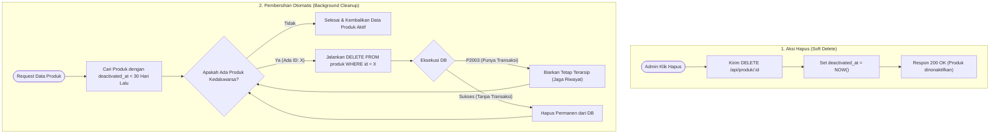
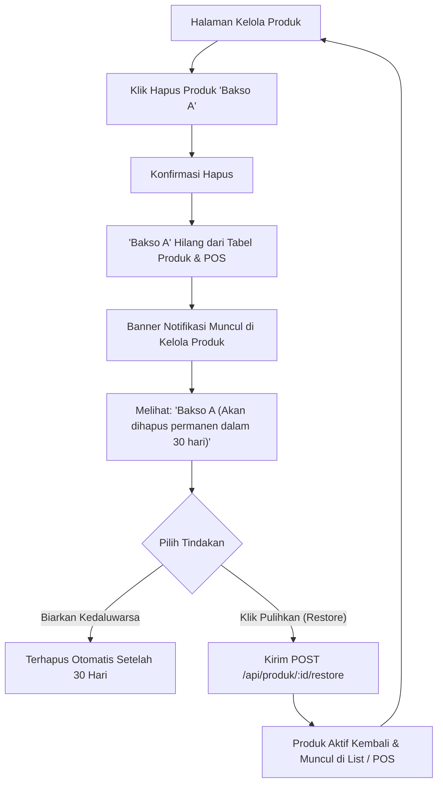
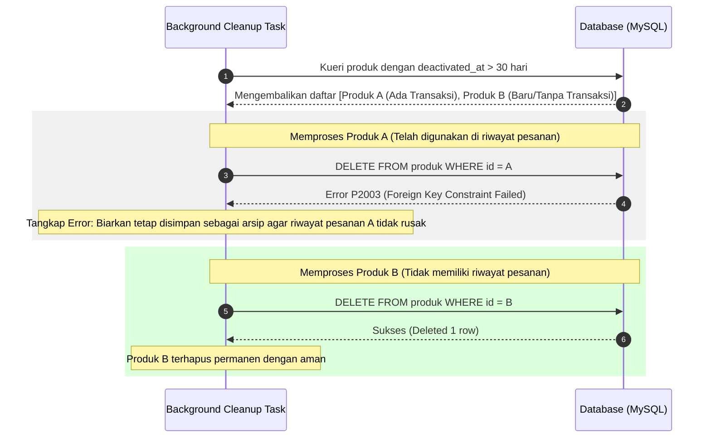

# Rancangan Fitur: Deaktivasi & Pembersihan Produk Otomatis (30 Hari)

Dokumen ini berisi rancangan teknis untuk memperbarui logika penghapusan produk. Alih-alih menghapus data secara permanen yang memicu error relasi (*foreign key*), produk akan dinonaktifkan (*deactive*) selama 30 hari. Setelah 30 hari, produk akan dihapus secara otomatis jika aman dari relasi transaksi.

---

## 1. Perubahan Basis Data & Backend

### 1.1 Skema Database (`schema.prisma`)
Menambahkan kolom `deactivatedAt` pada tabel `Produk` untuk merekam tanggal penonaktifan:
```prisma
model Produk {
  id            Int             @id @default(autoincrement())
  namaProduk    String          @map("nama_produk") @db.VarChar(100)
  kategori      String          @default("Makanan") @db.VarChar(50)
  harga         Decimal         @db.Decimal(10, 2)
  stok          Int
  deactivatedAt DateTime?       @map("deactivated_at") // Kolom baru
  createdAt     DateTime        @default(now()) @map("created_at")
  updatedAt     DateTime        @updatedAt @map("updated_at")
  detailPesanan DetailPesanan[]

  @@map("produk")
}
```

### 1.2 Logika Penghapusan (`produkController.js` -> `deleteProduk`)
Ketika Admin menghapus produk:
*   Sistem tidak menjalankan `DELETE`, melainkan memperbarui `deactivatedAt` dengan waktu saat ini (`new Date()`).
*   Mengembalikan status `200 OK` dengan pesan `"Produk berhasil dinonaktifkan (arsip) selama 30 hari"`.

### 1.3 Logika Pemfilteran Daftar Produk (`produkController.js` -> `getAllProduk`)
*   Secara default, kueri hanya mengambil produk yang aktif (`deactivatedAt: null`).
*   Ini otomatis menyembunyikan produk deaktif dari daftar kasir (POS) dan daftar manajemen produk aktif.

### 1.4 API Baru untuk Notifikasi & Pemulihan
*   **`GET /api/produk/deactivated`**: Mengambil daftar produk yang dinonaktifkan beserta sisa hari sebelum penghapusan permanen.
*   **`POST /api/produk/:id/restore`**: Memulihkan kembali produk yang deaktif (`deactivatedAt: null`).

### 1.5 Logika Pembersihan Otomatis (Auto Cleanup)
Setiap kali data produk diakses, sistem menjalankan fungsi pembersihan secara asinkron (*background job*):
*   Mencari produk dengan `deactivatedAt` lebih tua dari 30 hari.
*   Mencoba menghapusnya secara permanen.
*   Jika produk memiliki transaksi (gagal karena *foreign key*), sistem membiarkannya tetap terarsip agar audit penjualan masa lalu aman. Jika tidak ada relasi transaksi, produk terhapus permanen dari database.

---

## 2. Flowchart Sistem (Logika Deaktivasi & Pembersihan)



---

## 3. Aliran Pengguna (User Flow)

User Flow ini menggambarkan bagaimana admin mengelola produk, melihat notifikasi produk deaktif, dan melakukan pemulihan (*restore*):



---

## 4. Diagram Penanganan Hambatan (Integritas Riwayat)

Diagram ini menunjukkan bagaimana sistem menangani benturan kueri agar tidak memicu error sistem sewaktu proses pembersihan 30 hari terjadi:


