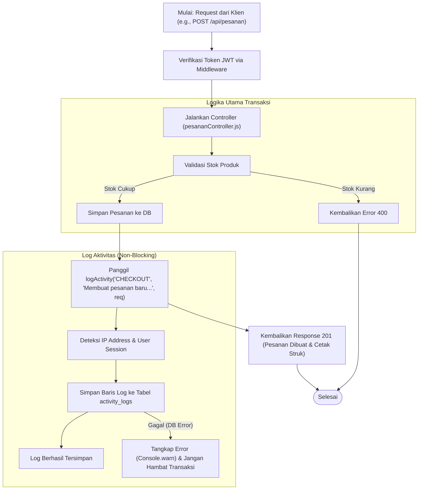
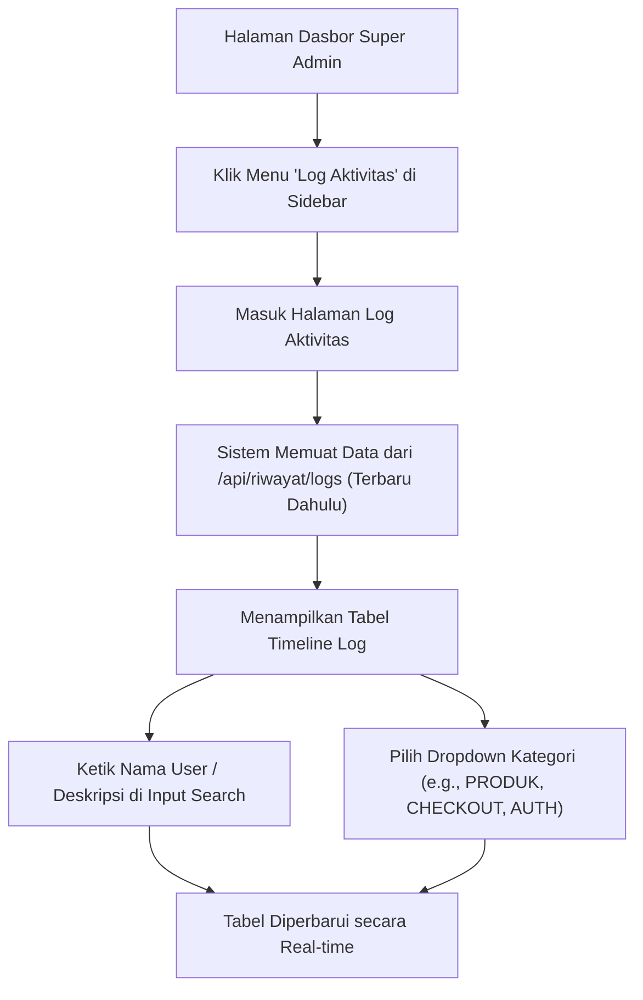
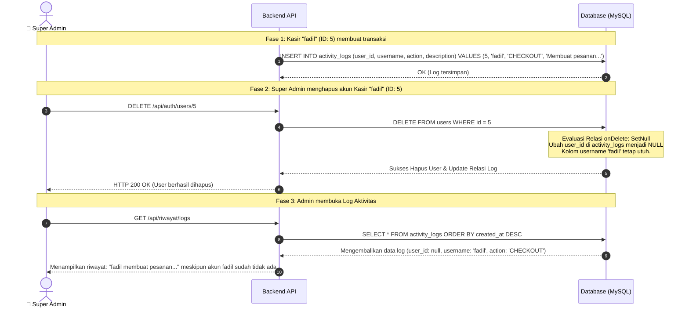

# Rancangan Fitur: Modul Log Aktivitas Detail

Dokumen ini berisi rancangan teknis untuk menambahkan **Modul Log Aktivitas** terperinci pada aplikasi Kasir Baksoku. Modul ini mencatat semua tindakan penting yang dilakukan oleh Super Admin dan Kasir demi transparansi audit operasional.

---

## 1. Perubahan Basis Data (Database Schema)

Menambahkan model baru `ActivityLog` ke dalam tabel database MySQL via Prisma ORM:

```prisma
model ActivityLog {
  id          Int      @id @default(autoincrement())
  userId      Int?     @map("user_id") // Nullable jika user dihapus
  username    String   @db.VarChar(50)  // Tetap menyimpan nama user untuk audit historis
  action      String   @db.VarChar(100) // Kategori tindakan (e.g., LOGIN, CHECKOUT, CREATE_PRODUCT)
  description String   @db.VarChar(255) // Deskripsi detail aktivitas
  ipAddress   String?  @map("ip_address") @db.VarChar(45)
  createdAt   DateTime @default(now()) @map("created_at")

  user        User?    @relation(fields: [userId], references: [id], onDelete: SetNull)

  @@map("activity_logs")
}
```

### 1.1 Tindakan yang Dicatat (Logged Activities)
1.  **Autentikasi:** Login sukses, login gagal, dan logout.
2.  **Manajemen Produk:** Tambah produk, edit detail produk, deaktivasi (soft-delete), dan pemulihan (*restore*) produk.
3.  **Operasional Kasir (POS):** Transaksi pesanan baru (checkout) lengkap dengan total harga, dan penyelesaian antrian makanan (FIFO).
4.  **Manajemen Pengguna:** Penambahan akun kasir/admin baru, dan penghapusan akun.

---

## 2. Arsitektur Logging Backend

Pencatatan log diletakkan pada layer servis helper (`logger.js`) sehingga tidak mengganggu alur utama aplikasi (*non-blocking*):

```javascript
// logger.js
const logActivity = async (action, description, req, userOverride = null) => {
  try {
    const userId = userOverride ? userOverride.id : (req?.user ? req.user.id : null);
    const username = userOverride ? userOverride.username : (req?.user ? req.user.username : 'system');
    const ipAddress = req ? (req.ip || req.headers['x-forwarded-for'] || req.socket.remoteAddress || '') : '';

    await prisma.activityLog.create({
      data: { userId, username, action, description, ipAddress }
    });
  } catch (error) {
    console.error("[LOGGER ERROR] Gagal menulis log aktivitas:", error);
  }
};
```

---

## 3. Flowchart Alur Pencatatan Log

Diagram berikut menunjukkan bagaimana backend memproses request utama (misal: Checkout) sambil menulis log aktivitas secara paralel:



---

## 4. Aliran Pengguna (User Flow - Super Admin)

User Flow ini menggambarkan bagaimana Super Admin mengakses dan menyaring data log aktivitas:



---

## 5. Diagram Penanganan Hambatan (Integritas Data)

Diagram ini menunjukkan bagaimana modul log tetap aman dan tidak rusak meskipun user yang melakukan tindakan di masa lalu dihapus dari sistem (*Referential Integrity*):


