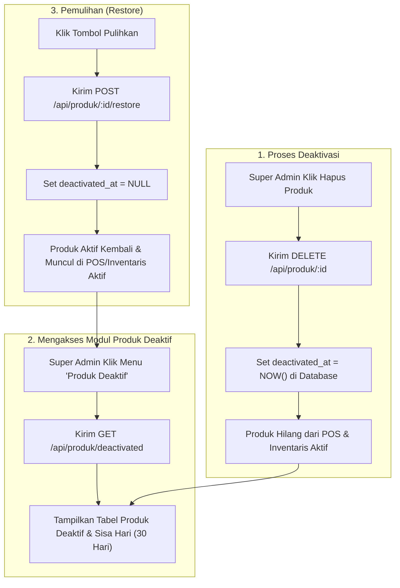
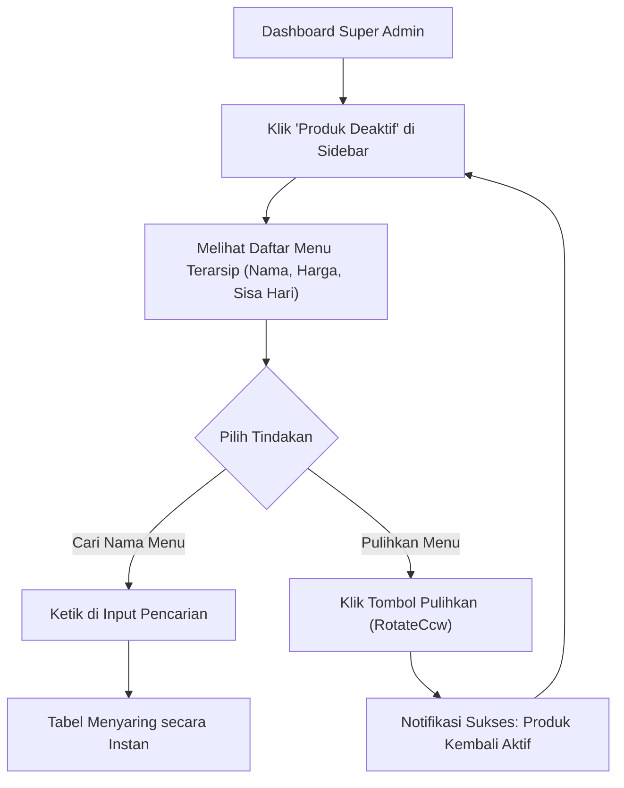
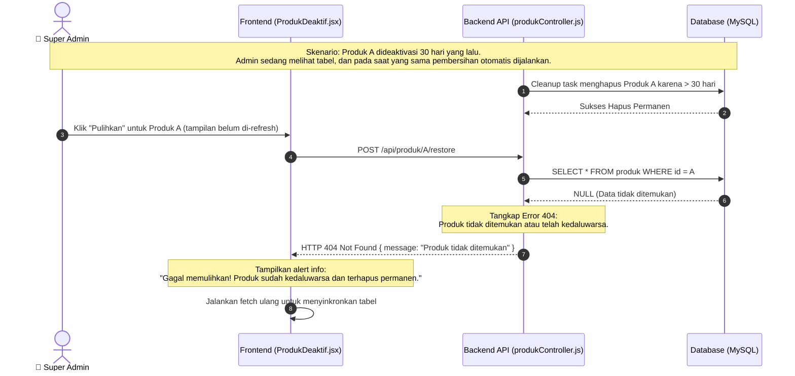

# Rancangan Fitur: Modul Produk Deaktif (Pengganti Log Aktivitas)

Dokumen ini berisi rancangan teknis untuk menghapus Modul Log Aktivitas dan menggantinya dengan **Modul Produk Deaktif** khusus di sidebar admin. Modul ini memudahkan Super Admin memantau menu apa saja yang sedang dinonaktifkan sementara serta sisa waktu penangguhannya sebelum dihapus permanen oleh sistem.

---

## 1. Pembersihan Modul Log Aktivitas (Revert Log Module)

Semua komponen terkait Log Aktivitas akan dibersihkan agar basis kode tetap ringkas dan bersih:
*   **Database:** Menghapus model `ActivityLog` dari `schema.prisma`.
*   **Backend:** Menghapus servis `logger.js`, `logController.js`, router `log.routes.js`, serta menghapus pemanggilan `logActivity` di seluruh *controllers*.
*   **Frontend:** Menghapus halaman `LogAktivitas.jsx` dan rutenya di `App.jsx`.

---

## 2. Implementasi Modul Produk Deaktif

### 2.1 API Backend yang Digunakan
Sistem akan memanfaatkan endpoint produk deaktif yang sudah kita buat sebelumnya:
1.  **`GET /api/produk/deactivated`**: Mengambil daftar produk dengan `deactivatedAt != null`.
2.  **`POST /api/produk/:id/restore`**: Mengaktifkan kembali produk deaktif (mengosongkan `deactivatedAt`).

### 2.2 Tampilan Baru Frontend (`ProdukDeaktif.jsx`)
Halaman baru akan menampilkan data produk deaktif dalam bentuk tabel atau grid kartu modern:
*   **Kolom Tabel:** Nama Produk, Kategori, Harga, Tanggal Dinonaktifkan, Sisa Hari Penangguhan (Hitung mundur dari 30 hari), dan Kolom Aksi.
*   **Aksi:** Tombol **Pulihkan** berikon `RotateCcw` untuk mengaktifkan kembali produk.
*   **Filter Pencarian:** Kolom pencarian real-time untuk mempermudah pencarian nama produk yang dinonaktifkan.
*   *Desain:* Konsisten dengan palet warna brand (Salmon & Teal), menggunakan ikon pendukung, dan **tidak menggunakan emoji**.

---

## 3. Flowchart Alur Produk Deaktif & Pemulihan

---

## 4. Aliran Pengguna (User Flow - Super Admin)

User Flow ini menggambarkan bagaimana Super Admin mengelola produk yang terarsip di menu khusus:

---

## 5. Diagram Penanganan Hambatan (Diagram Error)

Diagram berikut menjelaskan mitigasi kesalahan ketika Admin mencoba memulihkan produk yang sudah kedaluwarsa dan terhapus permanen oleh pembersihan otomatis (*race condition*):

