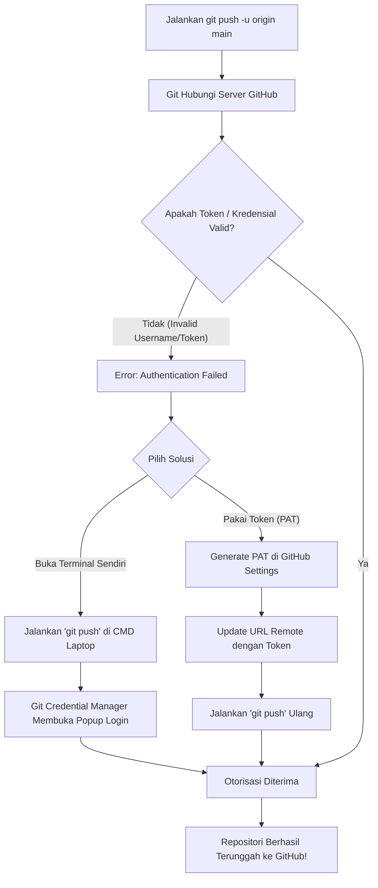
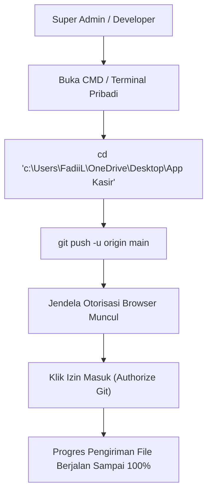
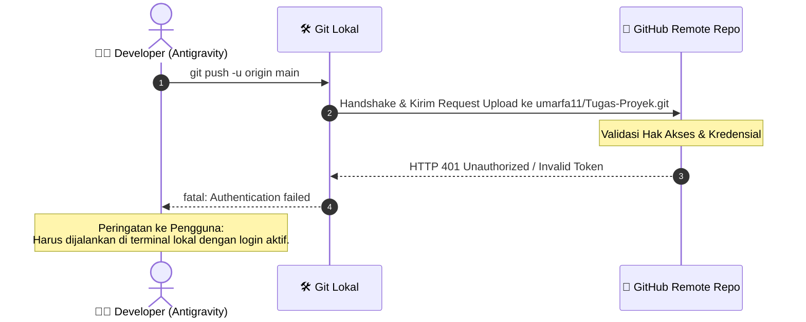

# Panduan Penanganan Error: Autentikasi Git (Push ke GitHub)

Dokumen ini menjelaskan mengapa proses `git push` otomatis gagal akibat masalah autentikasi kredensial GitHub dan memberikan solusi cara menyelesaikannya.

---

## 1. Penyebab Masalah (Root Cause)
Ketika sistem mencoba mengunggah berkas menggunakan perintah `git push -u origin main`, GitHub menolak permintaan tersebut dengan pesan:
> *remote: Invalid username or token. Password authentication is not supported for Git operations.*
> *fatal: Authentication failed for 'https://github.com/umarfa11/Tugas-Proyek.git/'*

Hal ini terjadi karena Git memerlukan **Personal Access Token (PAT)** atau otorisasi SSH Anda untuk mengunggah berkas ke repositori `umarfa11/Tugas-Proyek`. GitHub tidak lagi mendukung kata sandi akun biasa untuk operasi git push sejak Agustus 2021.

---

## 2. Solusi Langkah Demi Langkah (Penyelesaian Mandiri)

Karena kredensial GitHub terikat dengan akun Anda, Anda dapat melakukan push dengan salah satu cara berikut langsung dari terminal Anda sendiri:

### Cara 1: Menjalankan Push dari Terminal Lokal Anda (Rekomendasi)
Karena Git di perangkat Anda mungkin sudah terintegrasi dengan Git Credential Manager, silakan jalankan perintah ini di Command Prompt / PowerShell laptop Anda:
1.  Buka terminal/CMD Anda.
2.  Masuk ke direktori proyek:
    ```bash
    cd "c:\Users\FadiiL\OneDrive\Desktop\App Kasir"
    ```
3.  Jalankan perintah push:
    ```bash
    git push -u origin main
    ```
4.  Git Credential Manager akan membuka jendela popup browser untuk meminta Anda melakukan login dan memberikan izin akses secara instan.

### Cara 2: Menggunakan Personal Access Token (PAT)
Jika Anda ingin menggunakan Token Akses:
1.  Buat token baru di akun GitHub Anda melalui menu **Settings > Developer Settings > Personal Access Tokens > Tokens (classic)**. Centang opsi `repo`.
2.  Perbarui URL remote git Anda di terminal dengan menyertakan token tersebut:
    ```bash
    git remote set-url origin https://TOKEN_AKSES_ANDA@github.com/umarfa11/Tugas-Proyek.git
    ```
3.  Lakukan push kembali:
    ```bash
    git push -u origin main
    ```

---

## 3. Flowchart Penanganan Error Push



---

## 4. Aliran Navigasi Pengguna (User Flow - Developer)



---

## 5. Diagram Error Autentikasi


