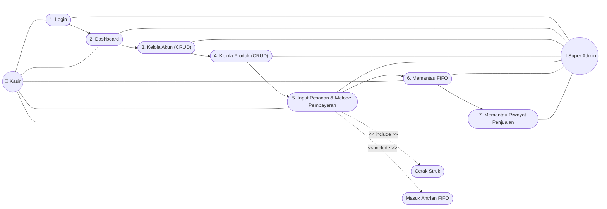

# Use Case Diagram

Berikut adalah representasi Use Case Diagram untuk aplikasi berdasarkan urutan yang diminta.

```mermaid
flowchart LR
    %% Definisi Aktor
    Kasir(("👤 Kasir"))
    SuperAdmin(("👤 Super Admin"))

    %% Grup Use Case utama yang berjejer vertikal sesuai urutan
    subgraph Sistem [ ]
        direction TB
        style Sistem fill:none,stroke:none
        
        Login(["1. Login"])
        Dashboard(["2. Dashboard"])
        KelolaAkun(["3. Kelola Akun (CRUD)"])
        KelolaProduk(["4. Kelola Produk (CRUD)"])
        InputPesanan(["5. Input Pesanan & Metode Pembayaran"])
        PantauFIFO(["6. Memantau FIFO"])
        Riwayat(["7. Memantau Riwayat Penjualan"])
        
        %% Panah vertikal di bagian tengah diagram menunjukkan urutan
        Login --> Dashboard
        Dashboard --> KelolaAkun
        KelolaAkun --> KelolaProduk
        KelolaProduk --> InputPesanan
        InputPesanan --> PantauFIFO
        PantauFIFO --> Riwayat
    end

    %% Use Cases untuk Include
    CetakStruk(["Cetak Struk"])
    AntrianFIFO(["Masuk Antrian FIFO"])

    %% Garis relasi antara Kasir dengan Use Cases
    Kasir --- Login
    Kasir --- Dashboard
    Kasir --- InputPesanan
    Kasir --- PantauFIFO
    Kasir --- Riwayat

    %% Garis relasi antara Super Admin dengan Use Cases
    Login --- SuperAdmin
    Dashboard --- SuperAdmin
    KelolaAkun --- SuperAdmin
    KelolaProduk --- SuperAdmin
    InputPesanan --- SuperAdmin
    PantauFIFO --- SuperAdmin
    Riwayat --- SuperAdmin

    %% Garis relasi Include
    InputPesanan -. "<< include >>" .-> CetakStruk
    InputPesanan -. "<< include >>" .-> AntrianFIFO
```
