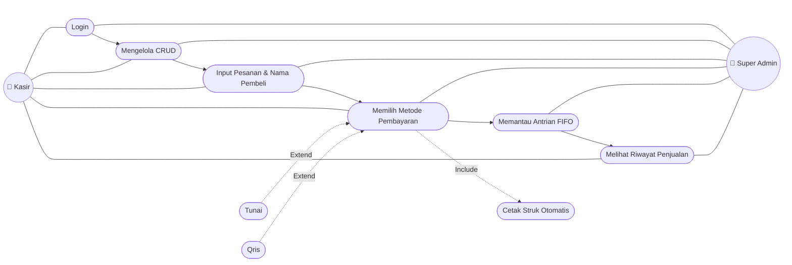

# Use Case Diagram

Berikut adalah representasi Use Case Diagram dalam format sintaks Mermaid JS, dibuat sama persis dengan alur dan struktur dari gambar yang Anda berikan.

```mermaid
flowchart LR
    %% Definisi Aktor
    Kasir(("👤 Kasir"))
    SuperAdmin(("👤 Super Admin"))

    %% Grup Use Case utama yang berjejer vertikal
    subgraph Sistem [ ]
        direction TB
        style Sistem fill:none,stroke:none
        
        Login(["Login"])
        CRUD(["Mengelola CRUD"])
        Input(["Input Pesanan & Nama Pembeli"])
        Bayar(["Memilih Metode Pembayaran"])
        FIFO(["Memantau Antrian FIFO"])
        Riwayat(["Melihat Riwayat Penjualan"])
        
        %% Panah vertikal di bagian tengah diagram
        Login --> CRUD
        CRUD --> Input
        Input --> Bayar
        Bayar --> FIFO
        FIFO --> Riwayat
    end

    %% Use Cases untuk Extend dan Include
    Tunai(["Tunai"])
    Qris(["Qris"])
    Struk(["Cetak Struk Otomatis"])

    %% Garis relasi antara Kasir dengan Use Cases
    Kasir --- Login
    Kasir --- CRUD
    Kasir --- Input
    Kasir --- Bayar
    Kasir --- Riwayat

    %% Garis relasi antara Super Admin dengan Use Cases
    Login --- SuperAdmin
    CRUD --- SuperAdmin
    Input --- SuperAdmin
    Bayar --- SuperAdmin
    FIFO --- SuperAdmin
    Riwayat --- SuperAdmin

    %% Garis relasi Extend & Include
    Tunai -. "Extend" .-> Bayar
    Qris -. "Extend" .-> Bayar
    Bayar -. "Include" .-> Struk
```
